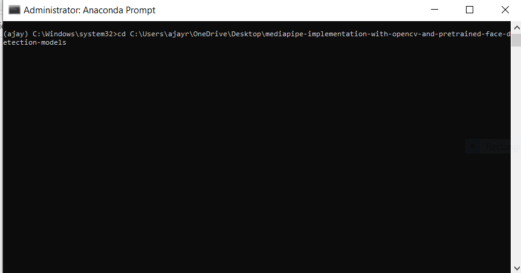

# Mediapipe-implementation-with-opencv-and-pretrained-face-detection-models

# What is MediaPipe?
MediaPipe is a framework for building pipelines to perform inference over arbitrary sensory data like images, audio streams and video streams.

With MediaPipe, a perception pipeline can be built as a graph of modular components, including model inference, media processing algorithms and data transformations.

MediaPipe is something that Google internally uses for its products since 2012 and open-sourced it in June 2019 at CVPR.

# Why MediaPipe?
MediaPipe provides cross-platform support, as an example development flow, this graph can be first developed and tested on desktop followed by deployment and final performance evaluation on mobile devices.

Rapid Prototyping :
For instance, a heavy NN-based object detector may be swapped out with a light template matching detector, and the rest of the graph can stay unchanged.

# Face Detection:
MediaPipe Face Detection is an face detection model that comes with 6 landmarks and multi-face support. It is based on BlazeFace, a lightweight and well-performing face detectortailored for mobile GPU inference. 

The detector’s super-realtime performance enables it to be applied to any live viewfinder experience that requires an accurate facial region of interest as an input for other task-specific models, such as 3D facial keypoint or geometry estimation.

# Detections:
Collection of detected faces, where each face is represented as a detection proto message that contains a bounding box and 6 key points (right eye, left eye, nose tip, mouth

center, right ear tragion, and left ear tragion). The bounding box is composed of xmin and width (both normalized to [0.0, 1.0] by the image width) and ymin and height (both 

normalized to [0.0, 1.0] by the image height). Each key point is composed of x and y, which are normalized to [0.0, 1.0] by the image width and height respectively.

Each facial feature is annotated around a particular landmark.

# Face mesh:

MediaPipe Face Mesh is a face geometry solution that estimates 468 3D face landmarks in real-time even on mobile devices. It employs machine learning (ML) to infer the 3D surface geometry, requiring only a single camera input without the need for a dedicated depth sensor. Utilizing lightweight model architectures together with GPU acceleration throughout the pipeline, the solution delivers real-time performance critical for live experiences.

 
                                                    
                                                     

Additionally, the solution is bundled with the Face Geometry module that bridges the gap between the face landmark estimation and useful real-time augmented reality (AR) applications. It establishes a metric 3D space and uses the face landmark screen positions to estimate face geometry within that space. The face geometry data consists of common 3D geometry primitives, including a face pose transformation matrix and a triangular face mesh. Under the hood, a lightweight statistical analysis method called Procrustes Analysis is employed to drive a robust, performant and portable logic. The analysis runs on CPU and has a minimal speed/memory footprint on top of the ML model inference.

## Handpose:
Using a detector, the pipeline first locates the person/pose region-of-interest (ROI) within the frame. The tracker subsequently predicts the pose landmarks within the ROI using the ROI-cropped frame as input. Note that for video use cases the detector is invoked only as needed, i.e., for the very first frame and when the tracker could no longer identify body pose presence in the previous frame. For other frames the pipeline simply derives the ROI from the previous frame’s pose landmarks.

                                 

# Prerequisites:
 #### python 3.6 and above
 #### mediapipe
 #### (mp_env): pip install mediapipe
 #### pip install opencv-python==3.4.2.16
 ### For Testing on your system, create a Python virtual environment:
   #### conda create -n yourenvname python=x.x anaconda
   
   Download the repo: https://github.com/ajayraju111/mediapipe-implementation-with-opencv-and-pretrained-face-detection-models
   
   
   
   
   
   
   
   
   
   
 

Example Running any file:
 
 

